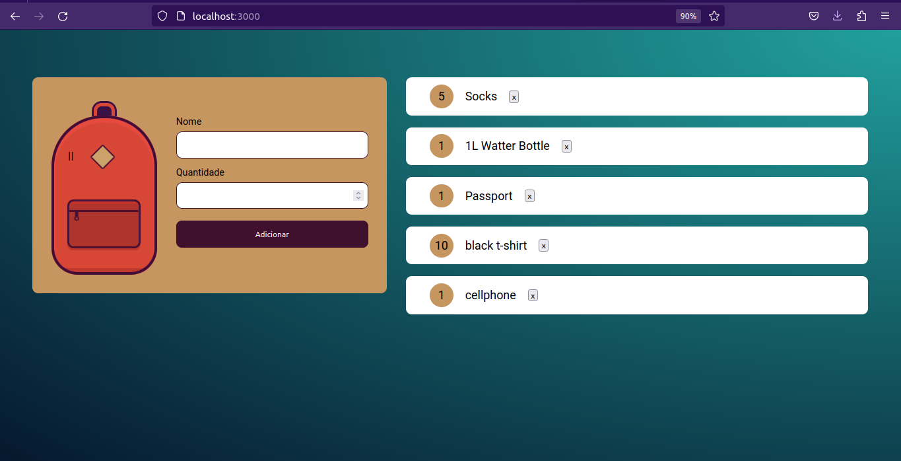

# Lista de Viagens - Containerizado

 

Olá! Esse é o meu primeiro projeto utilizando Docker 🐳, se trata de um site simples onde você pode montar a sua listinha de itens para viajem, mas eu tô muito feliz e animado pra aprender a usar containers! :)

Para testar este projeto, crie uma imagem docker com

    docker build -t travel-backpack .

E depois, crie um container para rodar no segundo plano e com port mapping usando: 

    docker run -dp 127.0.0.1:3000:3000 travel-backpack 

Depos disso, apenas acesse http://127.0.0.1:3000 e pronto! Obrigado pela atenção ;)
